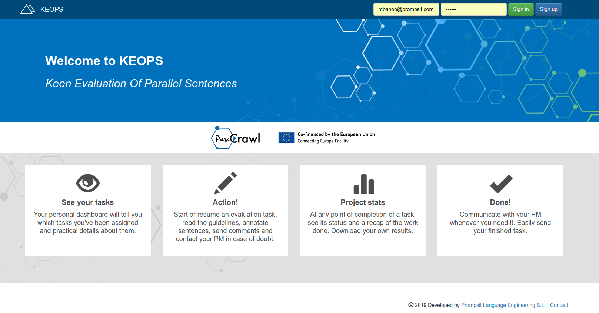
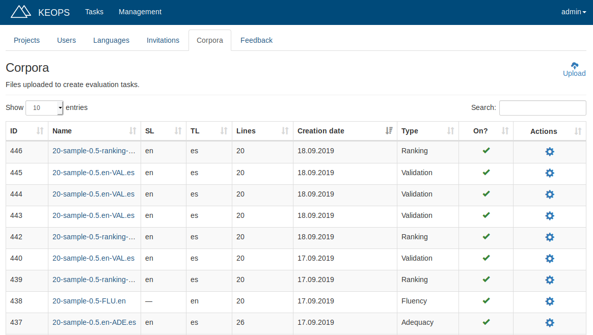
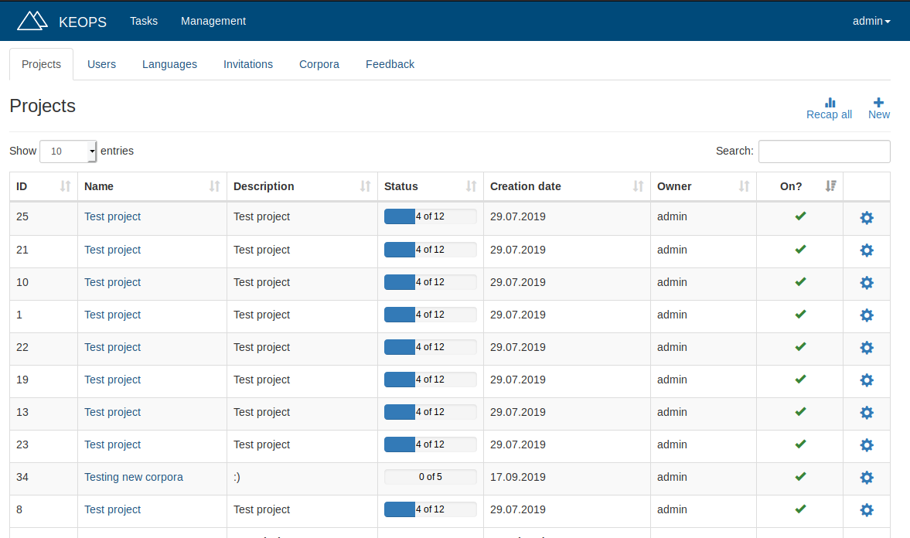
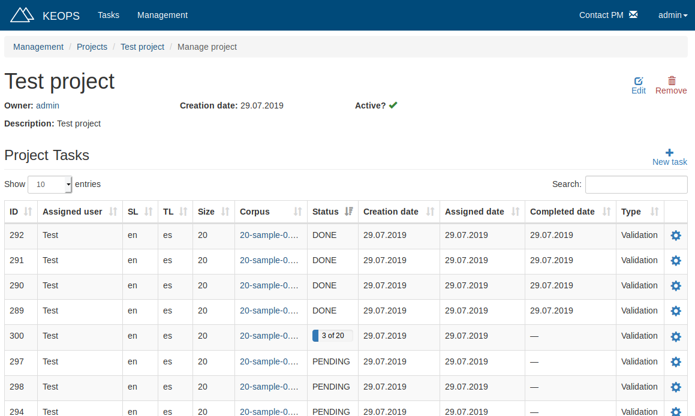
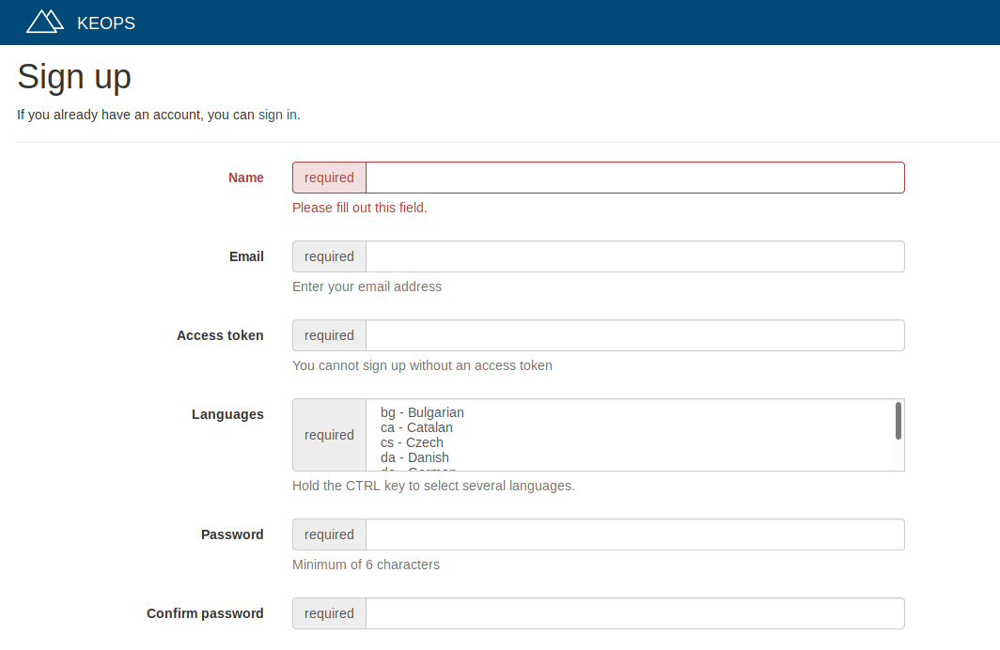
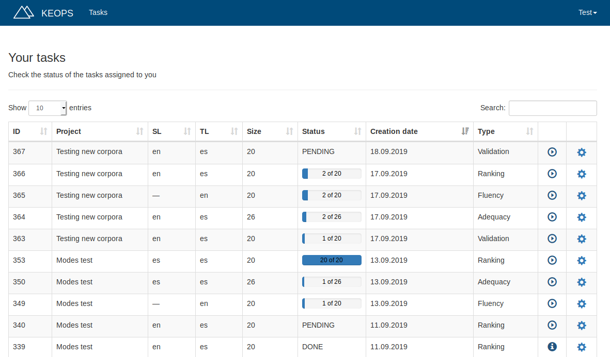
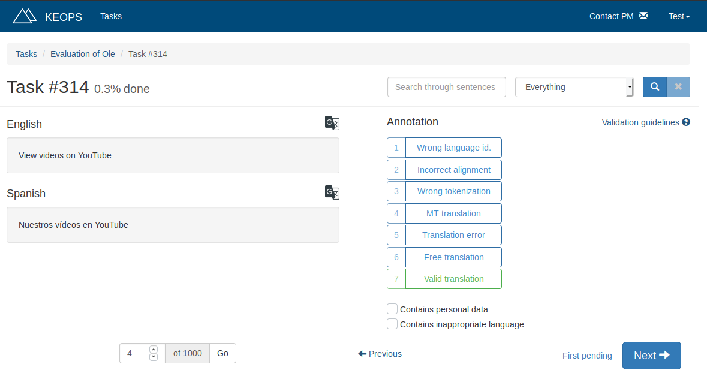
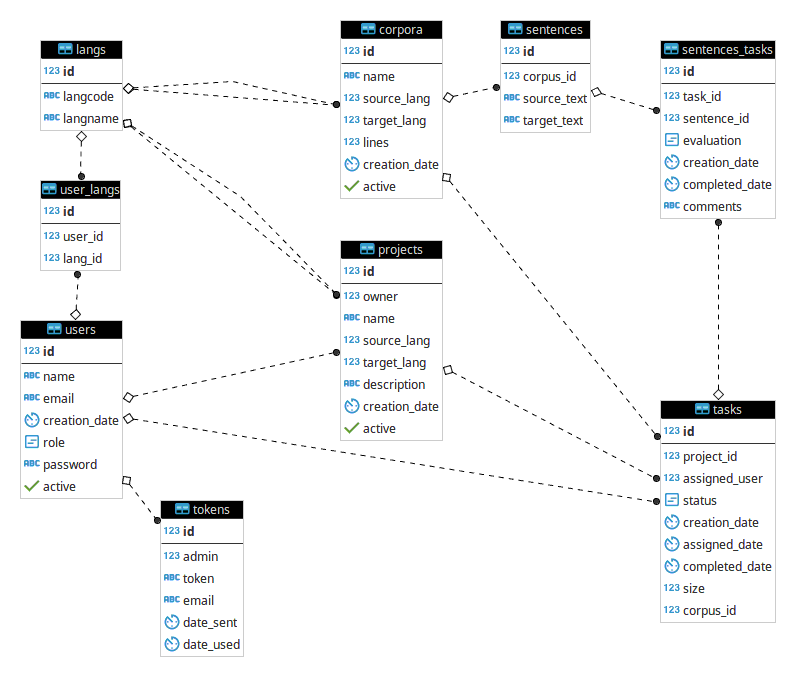

# KEOPS (Keen Evaluator Of Parallel Sentences)

KEOPS (Keen Evaluation Of Parallel Sentences) provides a complete tool for manual evaluation of parallel sentences.

It can be installed, or run inside a Docker. See [INSTALLATION.md](INSTALLATION.md) for more information.

## Overview ##

There are two main types of users in Keops: **Users** (also known as "Evaluators") and **Admins**.
Admins can perform management tasks (such as creating tasks, uploading corpora to evaluate, invite users...) and evaluation tasks,
while regular Users can only perform evaluation tasks (assigned by the Admins).

### Admins ###
The most common **workflow** for an **Admin** is as follows: 

First, the Admin **invites** the evaluators to Keops, if they are not Keops users yet. For this, the Admin just needs their emails, and give them the **invitation token** generated by Keops.
The invitation token, together with the user email, is what an user needs to create its account.

Then the admin **uploads** one (or more) parallel **corpus**, indicating the source and target languages (most common EU languages are pre-loaded, but Admins can add new ones beforehand, if needed).

After these two first steps, the Admin creates a new **Project**, indicating its source and target languages.

When the project is created, the Admin can create **Tasks** in the Project. 
For this, the Admin just needs to indicate who is the **evaluator** and the **corpus** to be evaluated. 
Please note that only users and corpora matching the project languages will be available for choosing.

Once the task is created, Evaluators can immediately start working on them.
When an Evaluator finishes evaluating all sentences from a task, and markes it as **DONE**, the Admin is able to **download** the stats of the evaluation (a CSV file containing the amount of sentences per evaluation label) and the annotated corpus (a TSV file containing the parallel sentences and their evaluations).

### Evaluators ###

The common **workflow** for an **Evaluator** is simpler:

After getting an **invitation** (an invitation token, together with the evaluator's email), the Evaluator **signs up** and creates an account.
It's important that Evaluators include their languages, so Admins can assign tasks to them. 

If the Evaluator already had an account in Keops, instead of signing up, the Evaluator just needs to **sign in**.

Once logged in, in their Keops **homepage**, Evaluators can see a list of **tasks** they are assigned to.  
Evaluators just need to click the **start/continue** button of the desired task, and then start evaluating.

In the **evaluation** page,  two sentences are displayed (source above and target below).
The evaluator has to **annotate** the parallel sentence, this is, choose the **label** that fits the most (Wrong language, MT translation...) in case of error, or mark it as valid is the parallel sentence is correct.
**Validation guidelines** are also available at any time to help the Evaluator to choose the right option. 
Evaluators are also allowed to add a **comment** to each parallel sentence, in order to clarify their annotations.

Once all sentences of a task are evaluated, the Evaluator is redirected to the **recap** page for the task, where the evaluation stats of the task are shown. 
By marking the task as **DONE**, the Evaluator states that the task is finished, and from that moment, the Admin is able to **download** the stats of the evaluation and the evaluated sentences.

## DB Schema ##

## Screenshots ##

## FAQ ##

* Corpus format:
* Preloaded languages 
* Validation guidelines

