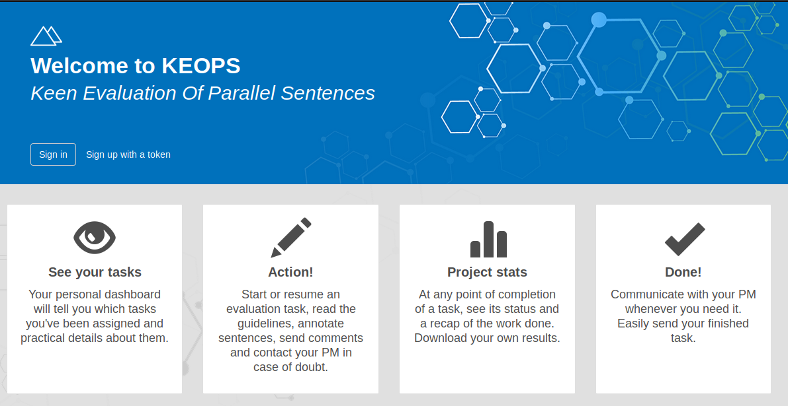
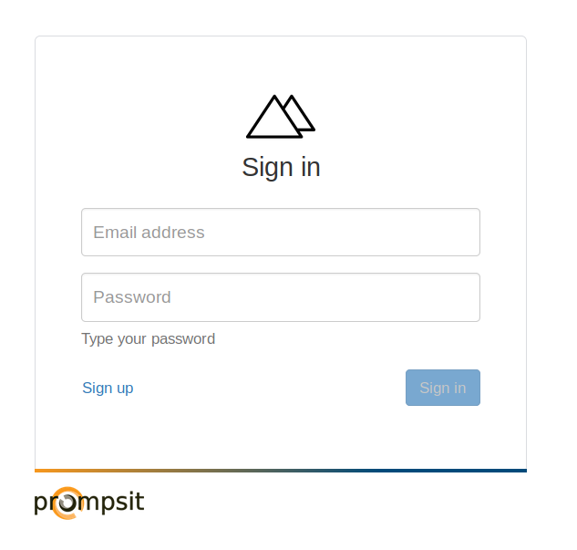
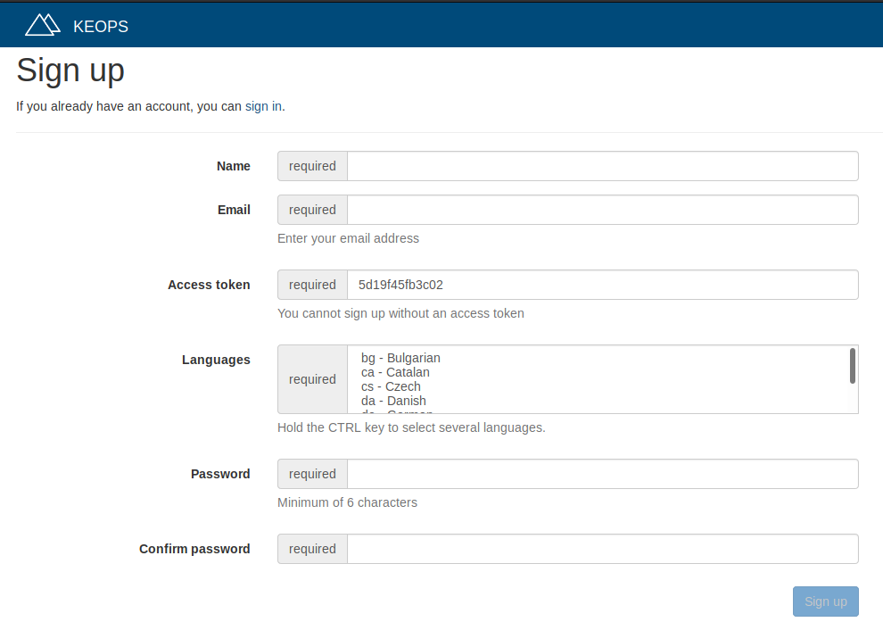
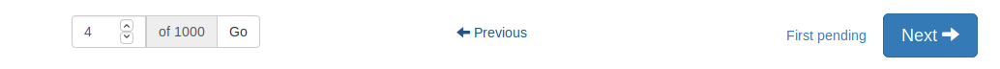
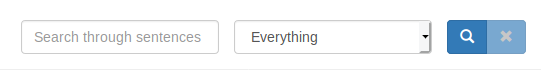
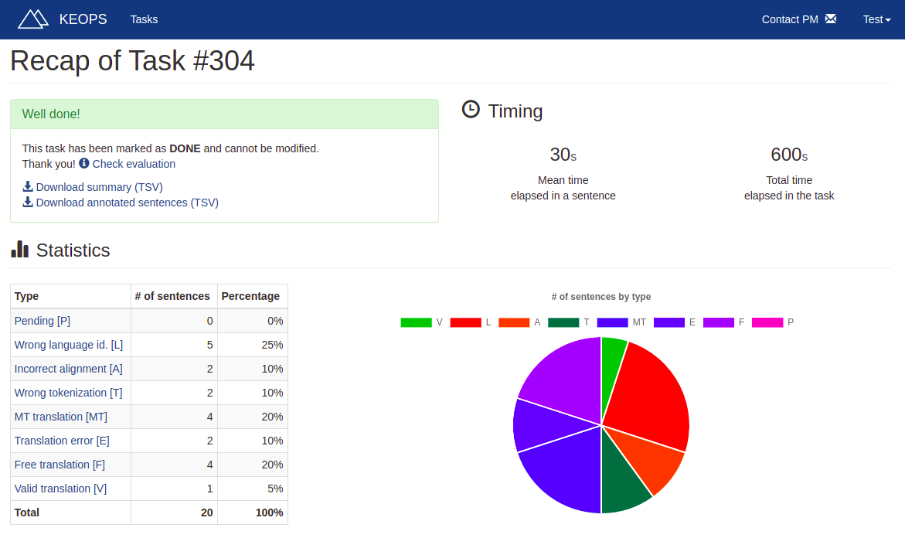
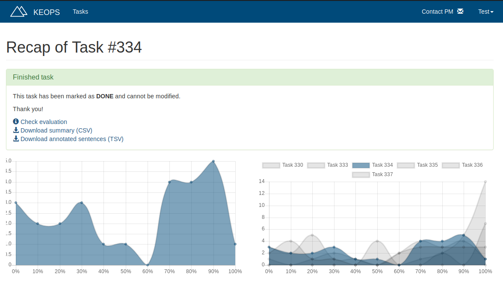

# KEOPS for evaluators
KEOPS (Keen Evaluation Of Parallel Sentences) provides a complete tool for manual evaluation of parallel sentences.

## Table of contents

* [Your role in keops](#role)
* [Getting started](#started)
* [Your tasks](#tasks)
* [Evaluating](#evaluating)
    * [Evaluation modes](#modes)
        * [Validation](#validation)
        * [Adequacy](#adequacy)
        * [Fluency](#fluency)
        * [Ranking](#ranking)
* [Once you're done](#done)
* [Getting in touch](#contact)
* [Let us know what you think](#feedback)

## Your role in KEOPS
The parallel sentences are organized in tasks. A task defines a group of sentences which should be reviewed by an evaluator in a certain way. 

As an evaluator, your mission is to evaluate the set of sentences contained in a task. The task will be assigned to you by an administrator, and you may be assigned one or more tasks.

## Getting started
In order to use KEOPS, you need an invitation. Only an admin can provide you with one. 

### Sign in
If you already have your evaluator account, sign in to use KEOPS. You can do this by clicking on _Sign in_ in the homepage.

This will take you to the _Sign in_ screen, where you have to fill the fields with your email and password.

### Sign up
When you are invited to KEOPS, you will get an invitation link. If you follow that link, you will be able to sign up.

Fill the required fields and click on _Sign up_. This will create your evaluator account. From now on, administrators can assign you tasks.

Instead of an invitation link, you could get an invitation token. This token will look like this:

    5d4404fb9f66a

On the Sign up screen, fill the _Access Token_ field with this token.

## Your tasks

Once you are signed in, you will see a list of tasks assigned to you. Whenever you are assigned a new one, you will be notified via email. This list provides the following information about each task:

* __ID__: identification of the task. You can use it, for example, to refer to a task when contacting support.
* __Project__: when several tasks are related, they are usually grouped in the same project.
* __SL__: Code of the source language of the task. For certain kinds of evaluation, this will be empty.
* __TL__: Code of the target language of the task. 
* __Status__: progress of the task. When you are not done yet with the task, it will show how many sentences are left to evaluate.
* __Creation date__: the date when the task was created.
* __Type__: defines the way this task should be evaluated. Please refer to the [Modes section](#modes) for more information.
* __Start button__: use it to start evaluating. When the task is done, it will change into an Information button.
* __Information button__: use it to review an evaluation which is already finished. You will not be able to change it.
* __Options button__: groups several actions, such as
    * __Recap button__: shows a sum-up of the task
    * __Contact button__: lets you get in touch with the Project administator.

## Evaluating
To start evaluating a task, click on the _Start_ button. Depending on the evaluation mode, this will take you to different screens. However, they all have something in common. To navigate through the task, use the buttons available on the bottom of the page.

Use the control on the left to jump to a certain sentence. The controls on the right are:
* Previous: shows the previous sentence.
* Next: shows the next sentence.
* First pending: shows the first sentence which has not been yet evaluated.

You can also search through the sentences using the search box. Depending on the evaluation mode, you can filter by labels too. Combine these at will: you may search a string, filter by a label or both at the same time.

### Evaluation modes
A task has always an evaluation mode. This will change the way you evalute the sentences.

#### Validation

This mode is used to classify pairs of sentences using the [European Language Resource Coordination (ELRC)](http://www.lr-coordination.eu/) validation guidelines. These guidelines define a set of labels to __annotate sentences following a hierarchical error typology__:

1. Wrong language identification (see examples [here](https://github.com/paracrawl/keops/blob/master/screenshots/guide/Wrong-language-identification.png))
2. Incorrect alignment (see examples [here](https://github.com/paracrawl/keops/blob/master/screenshots/guide/Incorrect-alignment.png))
3. Wrong tokenization (see examples [here](https://github.com/paracrawl/keops/blob/master/screenshots/guide/Wrong-Tokenization.png))
4. MT translation (see examples [here](https://github.com/paracrawl/keops/blob/master/screenshots/guide/MT-errors.png))
5. Translation error
6. Free translation

If none of these errors apply, the pairs are then considered as __valid__: 

7. Valid translation

More information about these labels is available on KEOPS (clicking on _Validation guidelines_). You may also refer to the [ELRC Validation Guidelines document](http://www.lr-coordination.eu/sites/default/files/common/Validation_guidelines_CEF-AT_v6.2_20180720.pdf).

When more than one issue appears in the evaluated sentences, please choose the first one according to the above referred error typology (1 to 7). 

If you don't select a label, the sentence will not be annotated and considered as __pending__.

When selecting some of the labels, you may be asked for additional information:
* __Wrong language identification__: whether the source, the target or both texts are wrongly identified.
* __MT Translation__: whether the source, the target or both text are MT-translated.
* __Free translation__: whether the translation should be kept, even though it is freely translated.

Please note that this additional information is completely optional to provide. Only if indicated by the PM, you should add it to the previous annotation.

Moreover, KEOPS can be also used to flag sentences which contain personal data or inappropriate language. This is done by using the checkboxes on the bottom right of the screen. 

* A pair of sentences contains personal data when the content includes proper names or other personal data that could be anonymised for data protection purposes.
* A pair of sentences contains inappropriate language when it includes profane expressions.

This is also additional information that only needs to be provided in addition to the error (1-6) or valid (7) labels annotation. 

Finally, some keyboard shortcuts are available. Press the key corresponding to the number of the label to select it. If an optional question is available, you can answer using <kbd>←</kbd> or <kbd>→</kbd>. Press <kbd>Enter</kbd> to save the evaluation and go to the next sentence.

#### Adequacy

When evaluating adequacy, you must assess that the candidate translation expresses the meaning of the source text in an adequate way. This is, that the candidate translation accurately captures the meaning of the source text.

The source text is presented to you on the left of the screen and, the candidate translation, on the right. 

Use the slider control on the right to evaluate the adequacy of the candidate translation. This slider starts with very low rating on the left (red color) and ends with very high rating on the right (green color).

You can control the slider using the keyboard. Use <kbd>+</kbd> to increase the rating, <kbd>-</kbd> to decrease it and <kbd>.</kbd> to set it to a half.

Please note that label filtering is not available in this mode, since labels are not used.

#### Fluency

When evaluating fluency, you must assess that the presented text is fluent in its language. The sentence to evaluate is shown on the left of the screen. 

Use the slider control on the right to evaluate the fluency of the text. This slider starts with very low rating on the left (red color) and ends with very high rating on the right (green color).

You can control the slider using the keyboard. Use <kbd>+</kbd> to increase the rating, <kbd>-</kbd> to decrease it and <kbd>.</kbd> to set it to a half.

Label filtering is not available in this mode, since labels are not used.

#### Ranking

When performing this kind of evaluation, a source text and a reference translation is presented to you. Then, you must rank a set of candidate translations from best to worst. If two translations are identical, set the same number to them. Always start with best position in the ranking (1).

When you search in this mode, please note that label filtering is not available because labels are not used.

You can order the translations using the mouse or the keyboard:

__Mouse__

Hold <kbd>Ctrl</kbd> and click on each translation in the desired order to set that ranking. 

__Keyboard__

Press the numbers of the keyboard to order the translations. When you press the first number, the first sentence will be assigned to that position. 

Then, you will automatically jump to the next translation. Keep on pressing numbers to assign a position to every translation. If you ever need to move to a translation manually, use the <kbd>+</kbd> and <kbd>-</kbd> keys. Press <kbd>Enter</kbd> to save the ranking and go to the next sentence. Alternatively, you can type the sentence position in the field on its left.

## Once you're done
The Project Manager will be notified via mail when you finish a task.

Every task has its own _recap_. A recap shows information about the task depending on its evaluation mode and its current status (whether it is finished or not).

For instance, the recap of a [validation task](#validation) shows a chart and a table of the evaluation of the sentences in that task.

If you finish an adequacy task, you will see two charts. The one on the left represents the ratings you gave in your evaluation. The one on the right compares your ratings to other tasks which evaluate the same set of sentences.

Your evaluation is also available for __download__:
* A summary of the task can be downloaded as a TSV file (tab-separated values). 
* A detailed list of the evaluation of each sentence can be downloaded as a TSV file.

## Getting in touch
Whenever you run into a problem, an issue or you just have a doubt, you can get support using the contact form.

Click on the _Contact PM_ link on the top of the evaluation screen to get in touch with the Project Manager of that task. Use this to discuss issues and doubts about a particular task.

Click on the _Contact support_ link on the top right menu for any other subjects (platform-related errors, doubts about how to use KEOPS...)

## Let us know what you think
If you wish to share your thoughts about this product, we'll be happy to hear from you by filling the form available at the end of a task evaluation.
