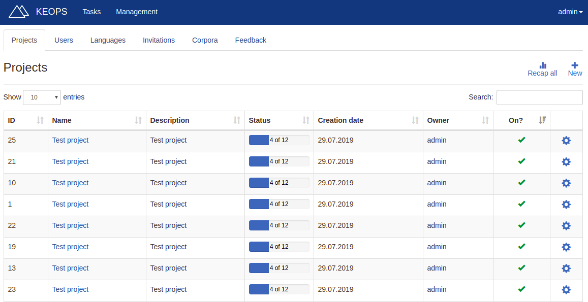
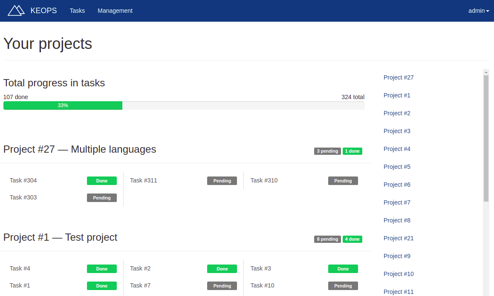

# KEOPS for project managers
KEOPS (Keen Evaluation Of Parallel Sentences) provides a complete tool for manual evaluation of parallel sentences.

## Table of contents
* [Your role in keops](#role)
* [Getting started](#started)
* [Managing tasks and projects](#tasks)
* [Evaluation modes](#modes)
* [Managing corpora](#corpora)
* [Managing users](#users)
* [Managing languages](#languages)
* [Feedback](#feedback)

<a name="role"></a>

## Your role in KEOPS
The parallel sentences are organized in tasks. A task defines a group of sentences which should be reviewed by an evaluator in a certain way. 

As a project manager, your mission is to create tasks, assign them to evaluators and track their progress. 

Even if you are a project manager, you can be assigned tasks. For more information about how to evaluate tasks, please refer to the [evaluators guide](evaluators.md).

<a name="started"></a>

## Getting started
In order to use KEOPS, you need an invitation. Only another project manager can provide you with one. In addition, the project manager who invited you has to grant project manager privileges to your account.

<a name="signin"></a>

### Sign in
If you already have your project manager account, sign in to use KEOPS. You can do this by clicking on _Sign in_ in the homepage.


This will take you to the _Sign in_ screen, where you just have to fill the fields with your email and password.


### Sign up
When you are invited to KEOPS, you will get an invitation link. If you follow that link, you will be able to sign up.

Fill the required fields and click on _Sign up_. This will create your evaluator account. From now on, you can sign in using your email and password.

Instead of an invitation link, you could get an invitation token. This token will look like this:

    5d4404fb9f66a

On the Sign up screen, fill the _Access Token_ field with this token.


<a name="tasks"></a>

## Managing tasks and projects
Projects group tasks which are somehow related. A task must __always__ belong to a project, so projects may contain only one task. When creating a project, you will be asked for a name and a description. Use this information to correctly identify your projects.



Tasks group sentences which should be evaluated in the same way. You can create tasks once you create the project they belong to. When creating a task, you will be asked for:
* __Mode__: the way this task should be evaluated. Refer to the [modes](#modes) section for more information.
* __Source language__: the language of the source texts. For certain kinds of evaluation, this will not be required.
* __Target language__: the language of the target texts.
* __Evaluator__: the evaluator who should evaluate this set of sentences. Only evaluators who have knowledge of both source and target languages can be chosen. 
* __Corpus__: the set of sentences to evaluate. Refer to [managing corpora](#corpora) for more information.


If you click on _Recap all_ on the Projects screen, you get an overview of all
your current projects and their tasks.



<a name="modes"></a>

## Evaluation modes
A task has always an evaluation mode. This will change the way evaluators review the sentences.

<a name="validation"></a>

#### Validation


This mode is used to classify pairs of sentences using the [European Language Resource Coordination (ELRC)](http://www.lr-coordination.eu/) validation guidelines. These guidelines define a set of labels to classify sentences:

1. Wrong language identification
2. Incorrect alignment
3. Wrong tokenization
4. MT translation
5. Translation error
6. Free translation
7. Valid translation

You may refer to the [ELRC Validation Guidelines document](http://www.lr-coordination.eu/sites/default/files/common/Validation_guidelines_CEF-AT_v6.2_20180720.pdf) for more information about these labels.

If a label is not selected, the sentence will be __pending__.

When selecting some of the labels, additional information may be asked:
* __Wrong language identification__: whether the source, the target or both texts are wrong identified.
* __MT Translation__: whether the source, the target or both texts are MT-translated.
* __Free translation__: whether the translation should be kept, even though it is a free one.

Please note that this additional information is completely optional to provide.

Moreover, KEOPS can be also used to flag sentences which contain personal data or inappropriate language. This is done by using the checkboxes on the bottom right of the screen. 

* A pair of sentences contains personal data when the content includes proper names or other personal data that could be anonymised for data protection purposes.
* A pair of sentences contains inappropriate language when it includes profane expressions.

<a name="adequacy"></a>

#### Adequacy


When evaluating adequacy, evaluators must assess that the candidate translation expresses the meaning of the source text in an adequate way. This is, that the candidate translation accurately captures the meaning of the source text.

The source text is presented to evaluators on the left of the screen and, the candidate translation, on the right.

<a name="qualitycontrol"></a>

 __Quality control__

Adequacy mode adds quality control sentences to the corpus. These sentences can be previewed at any time, and their creation is based on [the research of Cambridge Core](https://www.cambridge.org/core/journals/natural-language-engineering/article/can-machine-translation-systems-be-evaluated-by-the-crowd-alone/E29DA2BC8E6B99AA1481CC92FAB58462). 

Once the evaluator is done with the task, a score is computed assessing their performance on the control sentences. This score may be mediocre even for good evaluators, since the used metrics are strict. __We do not recommend to ban an evaluator because of this score as the only reason__. The score may be used as an illustrative measure of the performance of the user on that task, but project managers should always corroborate the score.

<a name="fluency"></a>

#### Fluency


When evaluating fluency, evaluators must assess that the presented text is fluent in its language. The sentence to evaluate is shown on the left of the screen. 

<a name="ranking"></a>

#### Ranking


When performing this kind of evaluation, a source text and a reference translation is presented to the evaluator. Then, evaluators must rank a set of candidate translations. The first position belongs to the best translation and, the last position, to the worst one.

<a name="corpora"></a>

## Managing corpora
A set of sentences is called a corpus. Corpora may have a different structure depending on the evaluation mode they are meant to be used in. KEOPS lets you upload, preview and assign corpora for evaluation. 

### Uploading corpora


Corpora is always uploaded in TSV format. This format uses one line per record and a tab character to separate fields.

The specific format of the TSV file is explained below for each of the evaluation modes. This information is alsa available on KEOPS clicking on _First time uploading corpora_. You can also download a template and use it to upload your data:

* [Validation template](/corpora/templates/validation.tsv)
* [Adequacy template](/corpora/templates/adequacy.tsv)
* [Fluency template](/corpora/templates/fluency.tsv)
* [Ranking template](/corpora/templates/ranking.tsv)

Please note that **all formats contain headers** which are necessary in
order to upload corpora to KEOPS. If you have a corpus without headers, you
can add them using:

```
echo -e "Source text\tTarget Text" | cat - paracrawl-v5.en-fr-0.7.shuf >
corpus-with headers
```

#### Corpora for validation
| Source text | Tab | Target text |
|----------------------------------------------------------------------|-----|-------------------------------------------------------------------------------------------------------------|
| You can contact our customer service department using the form below | Tab | Puedes ponerte en contacto con nuestro departamento de servicio al cliente mediante el siguiente formulario |

You should only include one target text for each source text.

#### Corpora for adequacy
| Source text | Tab | Candidate translation |
|----------------------------------------------------------------------|-----|-------------------------------------------------------------------------------------------------------------|
| You can contact our customer service department using the form below | Tab | Puedes ponerte en contacto con nuestro departamento de servicio al cliente mediante el siguiente formulario |

You should only include one candidate translation for each source text.

---

⚠️ Due to quality control sentences, uploading corpora for adequacy will result in a corpus __30% bigger__ than its original size. Learn more about quality control [here](#qualitycontrol)

---

#### Corpora for fluency
| Candidate translation |
|-----------------------|
Puedes ponerte en contacto con nuestro departamento de servicio al cliente mediante el siguiente formulario |

Corpora for fluency evaluation consist only on one column because they are monolingual tasks.

#### Corpora for ranking
| Source text | Tab | Reference text | Tab | Name of system 1 | Tab | Name of system 2 | Tab | ... |
|----------------------------------------------------------------------|-----|-------------------------------------------------------------------------------------------------------------|-----|--------------------------------|-----|--------------------------------|-----|-----|
| You can contact our customer service department using the form below | Tab | Puedes ponerte en contacto con nuestro departamento de servicio al cliente mediante el siguiente formulario | Tab | Manual de empleo y manutención | Tab | Manual de empleo y manutención | Tab | ... |

Include as many systems as you want.

<a name="users"></a>

## Managing users
As a project manager, you have de capability of inviting new users to KEOPS. The new users may have evaluator or project manager privileges.

### Inviting new users


Use the Invitations tab on the Management page to invite a user. You only need to provide their email address. Make sure to provide a valid one, since they will be notified via mail about the invitation.

### Modifying users


Once the user accepts the invitation and signs up, you can modify their information:
* __Name__: the name of the user.
* __Email__: the email address of the user.
* __Languages__: the languages the user has knowledge of.
* __Role__: whether this user is an evaluator or a project manager.
* __Active__: whether the user can sign in.

<a name="languages"></a>

## Managing languages


A comprehensive list of languages is already provided when KEOPS is installed. However, you may add additional languages using the _Add language_ action on the _Languages_ tab of the Managment screen.

When adding a new language, you are asked to type a language code and a language name.
* The language code must have the form of an [ISO 639-1 code](https://www.loc.gov/standards/iso639-2/php/code_list.php).
* The language name can be any string which describes the language (for example, "Spanish")

<a name="feedback"></a>

## Feedback


When an evaluator finishes a task, they can provide feedback about their experience. As a project manager, you can read this feedback on the Managment screen.

A list of the provided comments is displayed, along with the user who made them. If you click on _Contact_, you can get in touch with that user.

<a name="modes"></a>